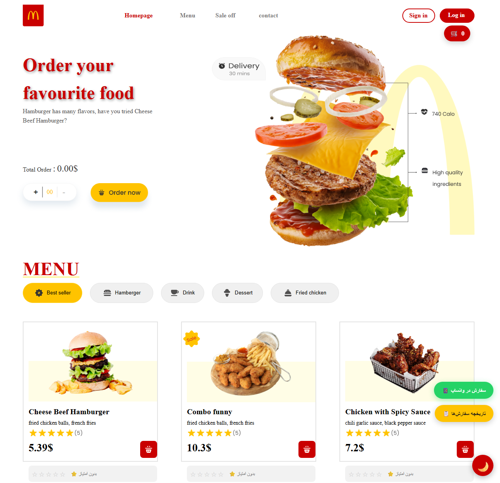
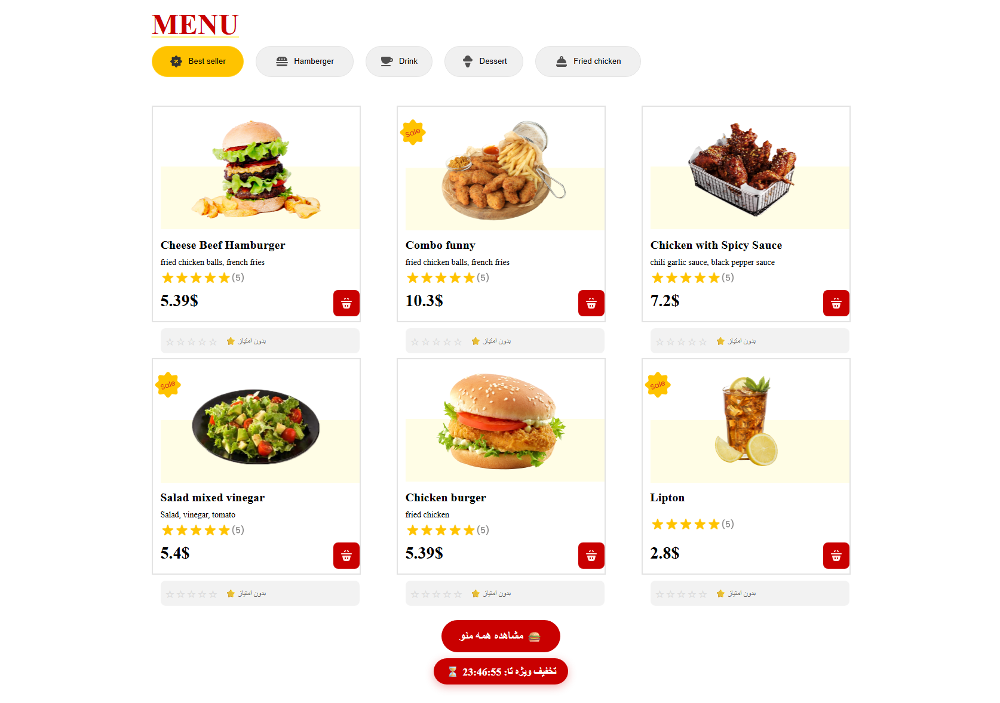
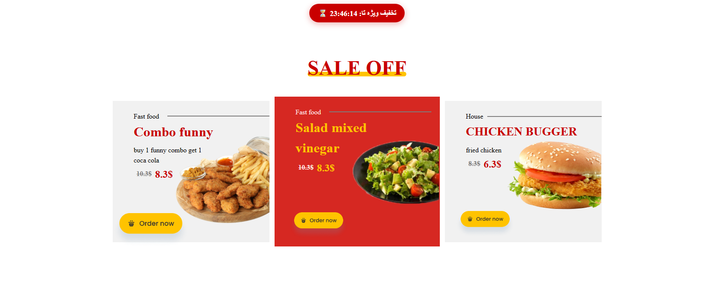

# 🍔 McDonald's Restaurant - Online Food Ordering

[](https://developer.mozilla.org/en-US/docs/Web/HTML)
[](https://developer.mozilla.org/en-US/docs/Web/CSS)
[](https://developer.mozilla.org/en-US/docs/Web/JavaScript)
[](https://github.com)
[](https://vercel.com)

> **A fully responsive restaurant ordering system inspired by McDonald's brand identity**

[🔗 Live Demo](https://motomaden.github.io/resturan/)  
[📂 GitHub Repository](https://motomaden.github.io/resturan/)

---

## 📸 Screenshots

| Homepage | Menu Section | Special Offers |
|----------|--------------|----------------|
|  |  |  |

### 🎥 Video Demo
[](https://youtu.be/your-video-id)

---

## 🎯 Architecture Overview
┌─────────────────────────────────────────────────────────────┐
│ Client Side │
│ ┌─────────────┐ ┌─────────────┐ ┌───────────────────┐ │
│ │ HTML5 │ │ CSS3 │ │ JavaScript │ │
│ │ Structure │ │ Styling │ │ App Logic │ │
│ └─────────────┘ └─────────────┘ └───────────────────┘ │
└─────────────────────────────────────────────────────────────┘
│
▼
┌─────────────────────────────────────────────────────────────┐
│ Browser Layer │
│ - LocalStorage (Cart, History, Ratings) │
│ - Service Worker (PWA ready) │
│ - Responsive Design (Mobile First) │
└─────────────────────────────────────────────────────────────┘
│
▼
┌─────────────────────────────────────────────────────────────┐
│ External Services │
│ - WhatsApp API (Direct ordering) │
│ - Vercel/Netlify (Hosting) │
└─────────────────────────────────────────────────────────────┘

---

## 🛠️ Technologies Used

### Frontend


### Tools


### Advanced Features


---

## ✨ Key Features

### 🛒 Shopping Cart System
- [x] **Add/Remove Items** with one click
- [x] **Auto-save** to LocalStorage
- [x] **Real-time total price** calculation
- [x] **Quantity controls** with + and - buttons
- [x] **Cart badge** showing item count

### 🍔 Food Menu
- [x] **Categories**: Best Seller, Hamburger, Drink, Dessert, Fried Chicken
- [x] **Smart filtering** with category buttons
- [x] **Live search** by typing food name
- [x] **Rating system** with star ratings (saved in LocalStorage)
- [x] **Average rating display** for each item

### 🎉 Special Offers Section
- [x] **3 featured deals** with discounts
- [x] **Countdown timer** for limited-time offers
- [x] **Auto-slider** on mobile devices
- [x] **Quick order** buttons

### 🌙 User Experience
- [x] **Dark/Light theme** toggle with LocalStorage persistence
- [x] **Fully responsive** (Mobile, Tablet, Desktop)
- [x] **Smooth animations** and haptic feedback
- [x] **Scroll progress bar**
- [x] **Welcome popup** for new visitors

### 📱 Additional Features
- [x] **WhatsApp ordering** with auto-generated message
- [x] **Order history** with status tracking
- [x] **Food rating system** with stars
- [x] **Back to top** button
- [x] **Hamburger menu** for mobile devices

---

## 🚀 Installation & Setup

### Prerequisites
- Modern browser (Chrome, Firefox, Safari, Edge)
- (Optional) Node.js for local server

### Installation Steps

**1. Clone the repository**
```bash
git clone https://github.com/motomaden/resturan.git
cd resturan
2. Run locally (with Live Server)
# Using VS Code Live Server extension
# Or using Python
python -m http.server 8000
3. Open in browser
http://localhost:8000
4. (Optional) Install dev dependencies
npm install -g live-server
live-server
Deployment
Vercel (Recommended)
npm install -g vercel
vercel
Netlify
# Upload files to Netlify Drop
# Or connect to GitHub repository
📁 Project Structure
mcdonald-restaurant/
│
├── index.html              # Main entry point
├── app.css                 # Core styles
├── media.css               # Responsive styles
├── app.js                  # Application logic (17+ features)
│
├── img/                    # Images
│   ├── lgo.png            # Logo
│   ├── Frame 29.png       # Delivery icon
│   ├── ammount.png        # Order button
│   ├── Burger.png         # Menu icon
│   ├── googleplay.png     # Download banner
│   └── food__menu/        # Food images
│       ├── 2.png
│       ├── 13.png
│       ├── saled.png
│       └── ...
│
└── off__offers/           # Offer images
    ├── 1.png
    ├── 20220905-113313 2.png
    └── burger_with_fried_chicken_2021_08_29_03_54_46_utc 1.png
🔧 Configuration & Customization
Change WhatsApp Number
In app.js, find this line:
const phoneNumber = "******";
Change Brand Colors
In app.css:
:root {
    --red: #c90000;      /* Primary red color */
    --yellow: #FFC300;   /* McDonald's yellow */
}
Update Prices
In index.html, edit prices:
<h3>5.39$</h3>  <!-- Food price -->
🧪 Testing
Manual Testing
# Test on different browsers
# Test responsive design (Chrome DevTools)
# Test cart functionality
# Test dark/light mode toggle
📈 Future Roadmap
□ Backend API with Node.js + Express
□ User authentication (Login/Register)
□ Payment integration (Stripe/PayPal)
□ Real-time order tracking
□ Admin dashboard for restaurant management
□ Push notifications for order updates
□ Multi-language support (i18n)
□ Advanced analytics dashboard
□ Loyalty program with points system
🤝 Contributing
Contributions are welcome! Here's how you can help:

Fork the repository

Create a feature branch (git checkout -b feature/amazing)

Commit your changes (git commit -m 'Add amazing feature')

Push to the branch (git push origin feature/amazing)

Open a Pull Request

Guidelines
Follow existing code style

Write meaningful commit messages

Test your changes across devices

Update documentation if needed

📝 License
This project is licensed under the MIT License - see the LICENSE file for details.
👨‍💻 Developer
Ali Esmaeli

https://www.instagram.com/ali.esmaeli83/

https://motomaden.github.io/myresume/

ali.esmaeli83vfd@gmail.com

https://github.com/MOTOMADEN

https://t.me/Aligpor

🙏 Acknowledgments
Figma Design: McDonald's Redesign Challenge

Icons: Font Awesome, Material Icons

Fonts: Poppins from Google Fonts

Inspiration: McDonald's official website

⭐ Show Your Support
If you found this project helpful, please give it a ⭐ on GitHub!

Built with ❤️ using HTML, CSS, and JavaScript
